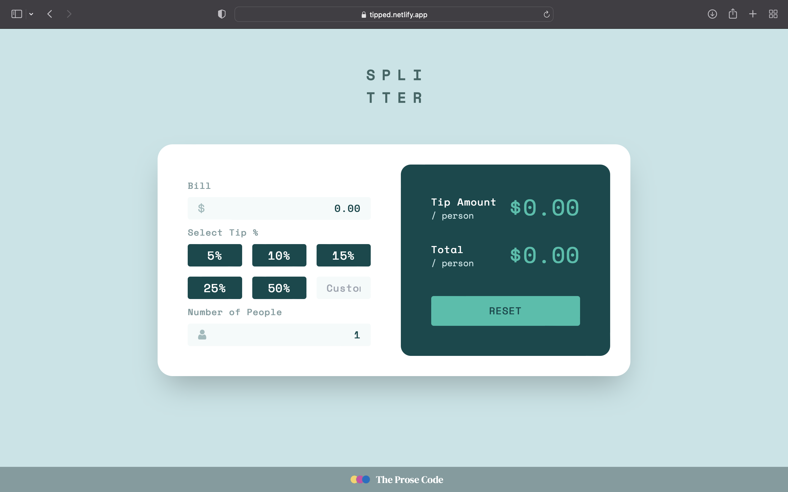
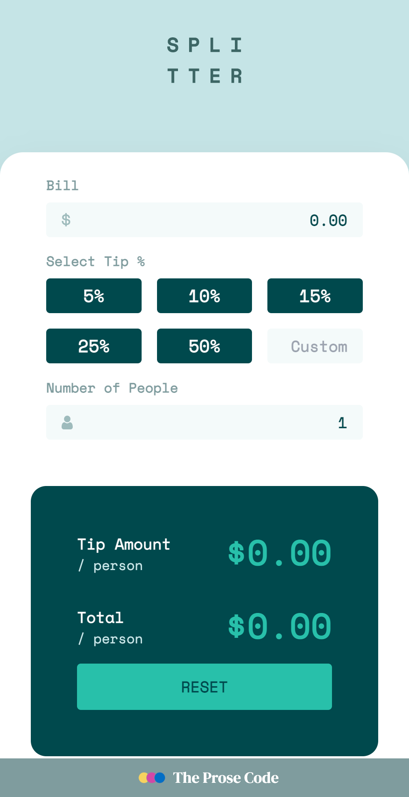

# Frontend Mentor - Tip calculator app solution

This is a solution to the [Tip Calculator challenge on Frontend Mentor](https://www.frontendmentor.io/solutions/tip-calculate-using-html-and-tailwind-0ASVaEbYE). Frontend Mentor challenges help you improve your coding skills by building realistic projects.

 
## Table of contents

- [Frontend Mentor - Tip calculator app solution](#frontend-mentor---tip-calculator-app-solution)
	- [Table of contents](#table-of-contents)
	- [Overview](#overview)
		- [Objective](#objective)
		- [Screenshot](#screenshot)
			- [Desktop](#desktop)
			- [Mobile](#mobile)
		- [Links](#links)
		- [Built with](#built-with)
	- [Author](#author)

## Overview

### Objective 
My goal with this project was mainly to get some practice using tailwindCSS. Tailwind is a utility-first CSS framework that helps you get started quickly building beautiful apps without writing a lot of custom CSS. 

### Screenshot

#### Desktop 

#### Mobile 

### Links

- Solution URL: [Add solution URL here](https://www.frontendmentor.io/solutions/tip-calculate-using-html-and-tailwind-0ASVaEbYE)
- Live Site URL: [Add live site URL here](https://tipped.netlify.app)

### Built with

- Semantic HTML5 markup
- Flexbox
- Mobile-first workflow
- [TailwindCSS](https://tailwindcss.com) - CSS Utility Framework

## Author

- LinkedIn - [P Pawan Bhandarkar](https://www.linkedin.com/in/bhandarkar/)
- Frontend Mentor - [@BhandarkarPawan](https://www.frontendmentor.io/profile/BhandarkarPawan)
- Twitter - [@BhandarkarPawan](https://twitter.com/BhandarkarPawan)
**Note: Delete this note and add/remove/edit lines above based on what links you'd like to share.**
